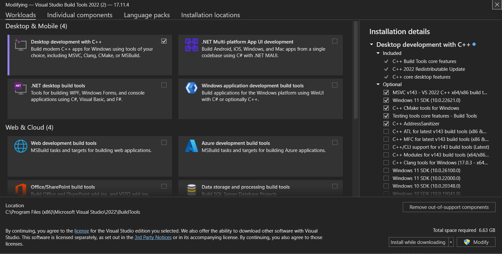

# LangChain RAG

## Pre-Requisite:

1. [Visual Studio C++ Build Tools](https://visualstudio.microsoft.com/visual-cpp-build-tools/) - make sure Visual Studio C++ build tools is installed in your system. Also Install the Desktop development with C++ package as shown below.
<br><br>

    

## Setup:

1. `python -m venv .venv` - setup virtual environment

2. `pip install -r requirements.txt` - install required libraries

3. Get API Key from [LangSmith](https://smith.langchain.com/o/851a7f35-766e-539c-ac83-166eb61ee3cc/)

4. Get API key from [groq](https://console.groq.com/keys) 

5. [Install Ollama CLI](https://ollama.com/download/OllamaSetup.exe)

6. ```bash
    ollama run llama3.1 # run in bash for ubuntu or cmd for windows
    ```